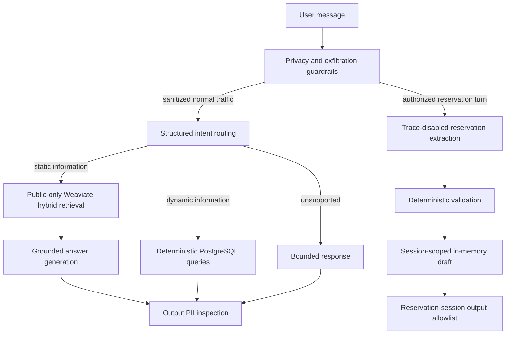
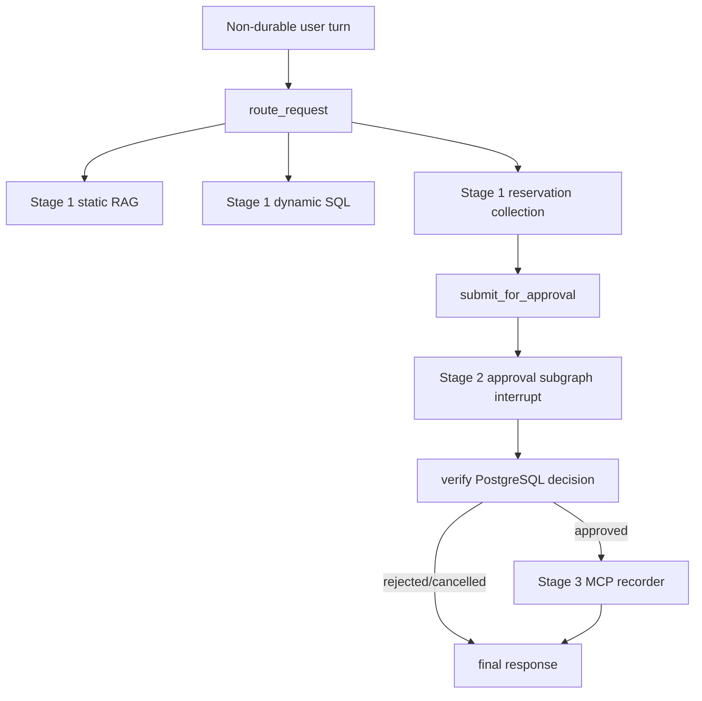
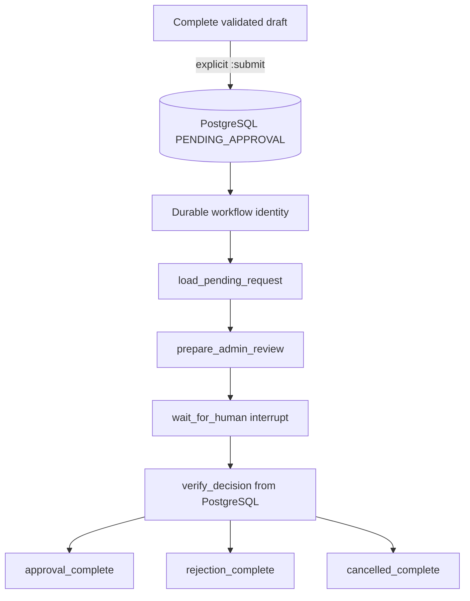

# Parking Assistant — Stage 4A complete

A production-oriented Python parking assistant with grounded public-information RAG,
deterministic operational reads, typed reservation-detail collection, and defense-in-depth
privacy controls, durable reservation requests, authenticated administrator decisions, a
durable LangGraph human-in-the-loop workflow, and authenticated idempotent MCP recording of
approved reservations, a unified master LangGraph, and an adapted official LangChain Agent Chat
UI. No LLM can approve or record an unapproved reservation.

## Architecture



LangChain provides model, embedding, and structured-output integrations. LangSmith traces the
sanitized normal path with meaningful routing, retrieval, generation, and dynamic-query spans.
Stage 4A adds a top-level graph without moving business rules into graph nodes:





## Static and dynamic data separation

- Weaviate stores only approved public static knowledge: location, access, policies,
  restrictions, booking instructions, and FAQ content. Every retrieval applies a mandatory
  `visibility=public` filter.
- PostgreSQL stores operational truth: parking spaces and statuses, current pricing, opening
  hours, and facility configuration. Dynamic answers use explicit SQLAlchemy queries, not RAG.
- Customer PII is never intentionally embedded or stored in Weaviate. Drafts remain process-local;
  only an explicit `submit_for_approval` call stores a validated request in PostgreSQL.

The application uses hybrid retrieval (`RAG_HYBRID_ALPHA=0.5`) because it combines semantic
matching with exact term signals. The final comparison against semantic and BM25 modes is in
[`evaluation/stage1_report.md`](evaluation/stage1_report.md).

## Setup

Requirements: Python 3.12, [`uv`](https://docs.astral.sh/uv/), Docker Compose v2, an OpenAI API
key, and optionally a LangSmith key.

```powershell
Copy-Item .env.example .env
uv python install 3.12
uv sync --locked
docker compose up -d
uv run alembic upgrade head
uv run python -m parking_assistant.db.seed
uv run python -m parking_assistant.rag.ingestion
```

The migration and seed commands initialize PostgreSQL. Ingestion loads only `data/static/*.md`,
validates public metadata, chunks the documents, creates application-side embeddings, and
upserts them into `PublicParkingKnowledge`.

## Use the assistant

```powershell
uv run python -m parking_assistant.api.cli "Where is the parking located?"
uv run python -m parking_assistant.api.cli "How many spaces are currently available?"
uv run python -m parking_assistant.api.cli "Are you open on Monday?"
uv run python -m parking_assistant.api.cli "What does parking cost?"
uv run python -m parking_assistant.api.cli --interactive
```

Synthetic interactive reservation example:

```text
I want to reserve a parking space tomorrow.
My name is Demo User and my demo plate is DEMO123.
Tomorrow from 10:00 to 13:00.
Actually, change the plate to TEST456.
Cancel this reservation.
```

The collector extracts first name, surname, car number, start, and end across turns. Names,
plates, periods, corrections, and completion are deterministically normalized and validated.
A complete draft remains correctable until explicit escalation. In interactive mode, `:submit`
calls the deterministic submission service once using the session's stable opaque key, creates a
durable workflow identity, and pauses the LangGraph workflow for real human review. It does not
check interval availability, confirm, or book the request.

## Stage 4A unified local demo

Raw user messages travel through non-durable LangGraph runtime context. Master checkpoints contain
only opaque identifiers, route/status values, missing-field names, recording state, and safe
messages. PostgreSQL remains authoritative for reservation PII and lifecycle state.

Start infrastructure, the authenticated MCP server, and the unified API:

```powershell
docker compose up -d
uv run alembic upgrade head
uv run python -m parking_assistant.db.seed
uv run python -m parking_assistant.rag.ingestion
uv run python -m parking_assistant.mcp.server

# Separate terminal
uv run uvicorn parking_assistant.api.unified:app --reload
```

Start the adapted official Agent Chat UI. Its Next.js server is the BFF, so the admin bearer token
is never included in browser source or URLs.

```powershell
Copy-Item frontend/.env.example frontend/.env
cd frontend
corepack pnpm install --frozen-lockfile
corepack pnpm dev
```

Open `http://localhost:3000`. The interface supports static/dynamic questions, multi-turn
reservation collection, pending human review, authenticated approve/reject controls, status
refresh, and MCP recording retry. The review panel separates authoritative database fields from
non-authoritative generated assistance.

Studio exposes both the master graph and focused Stage 2 graph:

```powershell
$env:LANGGRAPH_STRICT_MSGPACK = "true"
uv run langgraph dev --no-browser
```

## Stage 2 approval workflow and administrator API

Set a long random `ADMIN_API_TOKEN` and a non-secret `ADMIN_API_IDENTITY` in `.env`, then run:

```powershell
uv run alembic upgrade head
uv run uvicorn parking_assistant.api.main:app --reload
```

To demonstrate escalation, run the interactive assistant, collect a complete synthetic draft,
then enter `:submit`:

```powershell
uv run python -m parking_assistant.api.cli --interactive
```

The command returns `reservation_id`, `workflow_id`, and the durable `thread_id`. PostgreSQL stores
the reservation-to-workflow mapping. `PostgresSaver.setup()` is called idempotently by the application
and API startup paths, and checkpoints contain only safe identifiers/status fields.

The bearer token is demo administrator authentication, not production identity management.
Every `/admin/*` route requires it. These PowerShell examples use placeholders:

```powershell
$headers = @{ Authorization = "Bearer <ADMIN_API_TOKEN>" }

Invoke-RestMethod -Headers $headers `
  http://127.0.0.1:8000/admin/reservations/pending

Invoke-RestMethod -Headers $headers `
  http://127.0.0.1:8000/admin/reservations/<RESERVATION_ID>

Invoke-RestMethod -Headers $headers `
  http://127.0.0.1:8000/admin/reservations/<RESERVATION_ID>/review

Invoke-RestMethod -Method Post -Headers $headers `
  http://127.0.0.1:8000/admin/reservations/<RESERVATION_ID>/approve

Invoke-RestMethod -Method Post -Headers $headers -ContentType "application/json" `
  -Body '{"reason":"Synthetic demo reason"}' `
  http://127.0.0.1:8000/admin/reservations/<RESERVATION_ID>/reject
```

Application code submits a complete `ReservationDetails` through
`ReservationSubmissionService.submit_for_approval(details, facility_id=..., idempotency_key=...)`.
The opaque idempotency key should be stable for one completed draft/session and contain no PII.
The lifecycle is strictly `PENDING_APPROVAL` to one of `APPROVED`, `REJECTED`, or `CANCELLED`.
Repeating the same decision is safe; a contradictory decision returns HTTP 409. No approved
request becomes approved except through this authenticated human endpoint. In the standalone
Stage 3 API composition, configuring `MCP_SERVER_TOKEN` keeps the original post-commit recorder
behavior. In the unified Stage 4 application, the approve endpoint commits the decision and resumes
the graph; the graph is the single MCP owner. Recording failure leaves approval committed and
exposes an authenticated retry path.

## Stage 3 MCP confirmed-reservation recorder

> MCP does not authorize reservations. It only records reservations already approved by the
> human-controlled Stage 2 lifecycle.

The localhost Streamable HTTP endpoint exposes exactly one business tool:

```text
record_approved_reservation(reservation_id: UUID)
```

The request contains no PII or claimed status. The server independently loads PostgreSQL state
and refuses unknown, pending, rejected, cancelled, or approved rows without a decision timestamp.
Every `/mcp` request requires the `MCP_SERVER_TOKEN` bearer token; comparison is constant-time and
the token is never logged or returned.

`MCP_RESERVATION_FILE` is application configuration, never tool input. UTF-8 records use exactly
five fields. Facility name is reloaded from PostgreSQL, never accepted from the MCP caller:

```text
Name | Car Number | Facility | Reservation Period | Approval Time
Test User | DEMO123 | Central Station Parking | 2026-09-27 06:00+00:00–2026-09-27 09:00+00:00 | 2026-09-25 07:30:00+00:00
```

Timestamps are normalized to UTC. The writer creates parent directories, takes an exclusive
cross-process lock using an adjacent `.lock` file, upgrades an exact legacy four-field line in
place, checks for the identical canonical line, appends only when absent, flushes, and calls
`fsync`. The application client uses LangChain's
native `MCPAdapter` with authenticated Streamable HTTP, but selects the one named tool in
deterministic code; no tool is exposed to an LLM.

### Stage 3 demo

Set the Stage 2 and Stage 3 secrets in `.env`, migrate/seed PostgreSQL, and start the MCP server:

```powershell
uv run alembic upgrade head
uv run python -m parking_assistant.db.seed
uv run python -m parking_assistant.mcp.server
```

In another terminal, start the API and create a synthetic request through the existing Stage 2
interactive flow:

```powershell
uv run uvicorn parking_assistant.api.main:app --reload
uv run python -m parking_assistant.api.cli --interactive
```

After `:submit`, approve the returned identifier. PostgreSQL commits `APPROVED` before MCP runs:

```powershell
$adminHeaders = @{ Authorization = "Bearer $env:ADMIN_API_TOKEN" }
$reservationId = "<RESERVATION_ID>"
Invoke-RestMethod -Method Post -Headers $adminHeaders `
  "http://127.0.0.1:8000/admin/reservations/$reservationId/approve"
```

Invoke the client explicitly as a retry/idempotency demonstration, display the output, invoke it
again, and confirm the count remains one:

```powershell
uv run python -m parking_assistant.mcp.client $reservationId
Get-Content $env:MCP_RESERVATION_FILE
uv run python -m parking_assistant.mcp.client $reservationId
(Get-Content $env:MCP_RESERVATION_FILE).Count
```

The repeat result is `already_recorded`.

### Official MCP Inspector

Use Node 22.19 or newer. Start the official Inspector with the authenticated Streamable HTTP
endpoint (the command is pinned for repeatability):

```powershell
& "$env:ProgramFiles\nodejs\npx.cmd" --yes `
  @modelcontextprotocol/inspector@2.5.0 --web `
  --transport http --server-url http://127.0.0.1:8765/mcp `
  --header "Authorization: Bearer $env:MCP_SERVER_TOKEN"
```

In Inspector, connect, open **Tools**, and verify there is exactly one business tool. Its schema
must accept only `reservation_id`. Invoke it with an approved synthetic UUID and confirm the typed
`recorded` or `already_recorded` outcome. Invoke the same UUID again and confirm the configured
file line count does not change. Never include the bearer value in screenshots; crop or redact the
header field.

The executable evidence runner performs the same official Inspector CLI checks using a short-lived
synthetic token and retains no raw token or Inspector output:

```powershell
uv run python -m parking_assistant.evaluation.stage3_verification --inspector
```

The exact eight-shot evidence sequence is in
[`docs/stage3_screenshot_checklist.md`](docs/stage3_screenshot_checklist.md).

### Responsibility boundaries

- **PostgreSQL is authoritative:** it owns reservation PII, lifecycle status, administrator
  identity/reason, and the durable reservation-to-workflow mapping.
- **The administrator review agent is non-authoritative:** LangChain produces a subordinate
  structured brief with no lifecycle tools or decision field. Its PII-bearing call is trace-disabled.
- **LangGraph orchestrates:** it pauses at a real interrupt, persists through PostgresSaver, and
  resumes the same thread after a decision.
- **The authenticated human decides:** approve/reject/cancel endpoints commit the only valid
  lifecycle transitions. The graph ignores resume claims and re-reads PostgreSQL before routing.
- **MCP records but never authorizes:** after approval commits, the server re-reads PostgreSQL and
  performs only the idempotent configured-file side effect.

The graph state and interrupt payload contain identifiers and status only. Names, plates, requested
times, rejection reasons, and generated review text are not checkpointed.

The real graph topology is discoverable through `langgraph.json`:

```powershell
$env:LANGGRAPH_STRICT_MSGPACK = "true"
uv run langgraph dev --no-browser
```

The development server supplies its own tooling checkpointer. Production/demo execution through
the assistant and API explicitly uses `PostgresSaver`.

For an EU LangSmith environment, use:

```powershell
uv run langgraph dev --studio-url https://eu.smith.langchain.com
```

Studio exposes the actual application graph from `langgraph.json`; it does not replace or weaken
the production/demo PostgresSaver path.

## Privacy and security

Microsoft Presidio runs locally with deterministic recognizers for `PERSON`, `EMAIL_ADDRESS`,
`PHONE_NUMBER`, and the configured `CAR_NUMBER` pattern. Normal traffic is redacted before
intent classification, LangSmith tracing, Weaviate queries, embeddings, or grounded model
calls. General output is inspected again; approved public place names are explicitly preserved.

Reservation messages bypass normal routing and retrieval. Raw reservation details go only to
the authorized structured extractor under `tracing_context(enabled=False)`, deterministic
validation, and session-keyed memory. Complete responses may show only that session's validated
identity, plate, and period. Deterministic policy checks stop explicit prompt, secret, customer,
database, and vector-store exfiltration requests before model or data access.

Administrator responses may contain reservation PII because a human decision requires it. These
payloads are never routed to Weaviate, embeddings, general LangSmith traces, or application logs.
PostgreSQL and the explicitly configured confirmed-reservation text file are the authorized durable
PII stores. Only `reservation_id` crosses the authenticated MCP boundary; MCP payloads are not sent
to Weaviate, embeddings, normal LangSmith traces, or logs. For the assignment demo, database rows
and confirmed records are retained; production deployment must define retention and deletion.

Automated detection is defense in depth, not perfect authorization or a complete DLP system.

## LangSmith observability and demo evidence

No credential is hardcoded. Configure a dedicated project in `.env` or the shell:

```powershell
$env:LANGSMITH_TRACING = "true"
$env:LANGSMITH_PROJECT = "parking-assistant-stage1"
uv run python -m parking_assistant.evaluation.demo_traces
```

Normal traces use `parking_assistant_request`, `intent_routing`, `static_rag`,
`hybrid_retrieval`, `grounded_generation`, and `dynamic_query` where applicable. Inputs are
already sanitized and safe metadata includes route, retrieval mode, public source IDs, result
count, and PII entity types—not raw detected values. Reservation extraction remains untraced.

The Stage 2 evidence plan is
[`docs/stage2_screenshot_checklist.md`](docs/stage2_screenshot_checklist.md). Concise 5–7 slide
content is in [`docs/stage2_presentation_outline.md`](docs/stage2_presentation_outline.md).

## Evaluation

Run all evaluators against the configured real services:

```powershell
uv run python -m parking_assistant.rag.evaluation --all --k 5 `
  --output evaluation/retrieval_report.json
uv run python -m parking_assistant.evaluation.answer_quality --upload-langsmith
uv run python -m parking_assistant.evaluation.performance --samples 3
uv run python -m parking_assistant.guardrails.evaluation `
  --output evaluation/security_report.json
uv run python -m parking_assistant.evaluation.stage1_report
```

- Retrieval: 18 fixed queries, identical K, Precision@K, Recall@K, and MRR for semantic, BM25,
  and hybrid.
- Answer quality: 12 stable public questions scored for correctness, groundedness, and relevance;
  the same measured outputs and feedback are published as a LangSmith offline experiment.
- Performance: configurable sample count with average, p50, p95, and failures for hybrid
  retrieval, static RAG, PostgreSQL, routing, and a complete request.
- Security: 20 synthetic cases measuring leakage, malicious blocking, benign pass-through, and
  cross-session isolation.

The concise final report is [`evaluation/stage1_report.md`](evaluation/stage1_report.md), with
machine-readable underlying results in the adjacent JSON files.

Stage 2 has a separate administrator/workflow baseline and final report:

```powershell
uv run python -m parking_assistant.evaluation.stage2_performance --samples 3
uv run python -m parking_assistant.evaluation.stage2_report
```

The benchmark reports submission, graph start-to-interrupt, administrator lookup, approve/reject,
resume, and complete deterministic workflow latency separately from OpenAI-dependent review
generation. Results are in
[`evaluation/stage2_performance_report.md`](evaluation/stage2_performance_report.md) and
[`evaluation/stage2_report.md`](evaluation/stage2_report.md). Network/model measurements are an
observed baseline, not an SLA.

Stage 3 has executable PostgreSQL, authenticated MCP, security, idempotency, retry, Inspector, and
performance evidence:

```powershell
uv run python -m parking_assistant.evaluation.stage3_verification --inspector
uv run python -m parking_assistant.evaluation.stage3_performance --samples 3
uv run python -m parking_assistant.evaluation.stage3_report `
  --default-tests "<observed result>" --integration-tests "<observed result>"
```

The final factual summary is [`evaluation/stage3_report.md`](evaluation/stage3_report.md), backed
by adjacent JSON artifacts. The benchmark separates PostgreSQL authorization lookup, file append,
duplicate invocation, MCP transport, and the full approved recording path. Its small configurable
sample is a presentation-scale observation, not an SLA. The six-slide visual outline is
[`docs/stage3_presentation_outline.md`](docs/stage3_presentation_outline.md).

## Verification

```powershell
uv run ruff check .
uv run mypy
uv run pytest

$env:RUN_INTEGRATION_TESTS = "1"
uv run pytest -m integration
```

Unit/default tests mock model output where appropriate. Opt-in integrations exercise configured
OpenAI, PostgreSQL, and Weaviate services using public or explicitly synthetic data only.
Pytest is intentionally configured without coverage collection or a coverage threshold; the gates
report behavioral pass/fail results only.

## Important configuration

```text
OPENAI_MODEL=gpt-4.1-mini
OPENAI_EMBEDDING_MODEL=text-embedding-3-small
RESERVATION_CAR_NUMBER_PATTERN=^[A-Z0-9]{4,12}$
RAG_RETRIEVAL_LIMIT=5
RAG_HYBRID_ALPHA=0.5
LANGSMITH_TRACING=false
LANGSMITH_PROJECT=parking-assistant-stage1
ADMIN_API_TOKEN=<long-random-secret>
ADMIN_API_IDENTITY=demo-admin
MCP_SERVER_HOST=127.0.0.1
MCP_SERVER_PORT=8765
MCP_SERVER_TOKEN=<long-random-secret>
MCP_RESERVATION_FILE=data/confirmed_reservations.txt
LANGGRAPH_STRICT_MSGPACK=true
```

## Current limitations and roadmap

- OpenAI/Weaviate behavior and latency depend on external services and network conditions.
- Answer-quality judging uses a small curated dataset and an LLM judge; results are evidence,
  not a formal proof.
- PII/prompt-injection patterns can have false positives and false negatives.
- Durable reservation records have no automated retention/deletion yet.
- Bearer-token authentication is demo-grade and does not provide per-user identity management.
- Approval records the human decision and MCP file confirmation only; it does not recheck
  capacity, allocate a space, notify anyone, or create a separate booking entity.
- The generated admin brief depends on the configured model and is presentation assistance only;
  authoritative fields are always displayed separately.
- Checkpoint-table retention follows the demo database lifetime; no automated cleanup policy is
  implemented yet.
- MCP bearer authentication is assignment/demo-grade, without accounts, scopes, rotation, or TLS.
- The adjacent file lock coordinates a shared local filesystem, not distributed/network storage.
- Confirmed-record retention and automatic reconciliation after a prolonged MCP outage are not
  implemented.

Stage 4A is complete. Stage 4B is limited to final validation, complete load/E2E evidence, final
reporting, documentation cleanup, architecture diagrams, and presentation work.
