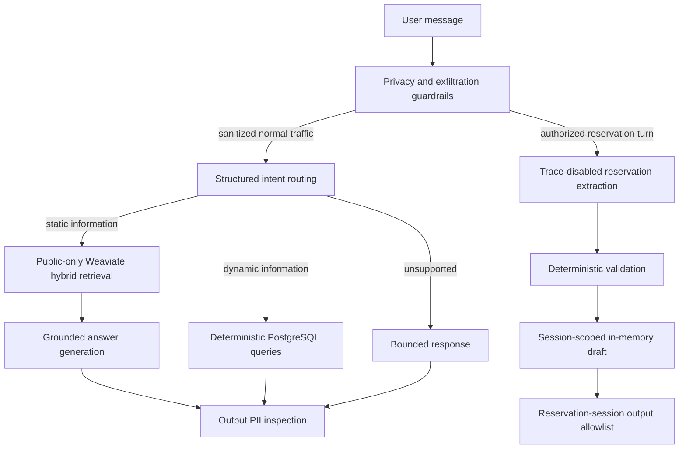
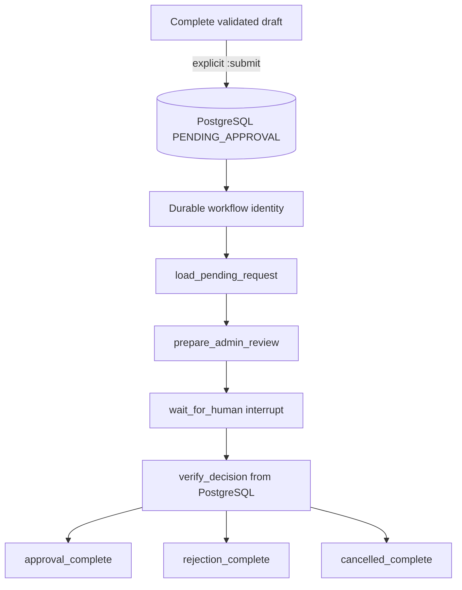

# Parking Assistant — Stage 2 complete

A production-oriented Python parking assistant with grounded public-information RAG,
deterministic operational reads, typed reservation-detail collection, and defense-in-depth
privacy controls, durable reservation requests, authenticated administrator decisions, and a
durable LangGraph human-in-the-loop workflow. Stage 2 never autonomously confirms or books a
reservation.

## Architecture



LangChain provides model, embedding, and structured-output integrations. LangSmith traces the
sanitized normal path with meaningful routing, retrieval, generation, and dynamic-query spans.
Notifications, MCP, confirmed-reservation recording, and final Stage 4 orchestration are
intentionally not part of Stage 2.



## Static and dynamic data separation

- Weaviate stores only approved public static knowledge: location, access, policies,
  restrictions, booking instructions, and FAQ content. Every retrieval applies a mandatory
  `visibility=public` filter.
- PostgreSQL stores operational truth: parking spaces and statuses, current pricing, opening
  hours, and facility configuration. Dynamic answers use explicit SQLAlchemy queries, not RAG.
- Customer PII is never intentionally embedded or stored in Weaviate. Drafts remain process-local;
  only an explicit `submit_for_approval` call stores a validated request in PostgreSQL.

The application uses hybrid retrieval (`RAG_HYBRID_ALPHA=0.5`) because it combines semantic
matching with exact term signals. The final comparison against semantic and BM25 modes is in
[`evaluation/stage1_report.md`](evaluation/stage1_report.md).

## Setup

Requirements: Python 3.12, [`uv`](https://docs.astral.sh/uv/), Docker Compose v2, an OpenAI API
key, and optionally a LangSmith key.

```powershell
Copy-Item .env.example .env
uv python install 3.12
uv sync --locked
docker compose up -d
uv run alembic upgrade head
uv run python -m parking_assistant.db.seed
uv run python -m parking_assistant.rag.ingestion
```

The migration and seed commands initialize PostgreSQL. Ingestion loads only `data/static/*.md`,
validates public metadata, chunks the documents, creates application-side embeddings, and
upserts them into `PublicParkingKnowledge`.

## Use the assistant

```powershell
uv run python -m parking_assistant.api.cli "Where is the parking located?"
uv run python -m parking_assistant.api.cli "How many spaces are currently available?"
uv run python -m parking_assistant.api.cli "Are you open on Monday?"
uv run python -m parking_assistant.api.cli "What does parking cost?"
uv run python -m parking_assistant.api.cli --interactive
```

Synthetic interactive reservation example:

```text
I want to reserve a parking space tomorrow.
My name is Demo User and my demo plate is DEMO123.
Tomorrow from 10:00 to 13:00.
Actually, change the plate to TEST456.
Cancel this reservation.
```

The collector extracts first name, surname, car number, start, and end across turns. Names,
plates, periods, corrections, and completion are deterministically normalized and validated.
A complete draft remains correctable until explicit escalation. In interactive mode, `:submit`
calls the deterministic submission service once using the session's stable opaque key, creates a
durable workflow identity, and pauses the LangGraph workflow for real human review. It does not
check interval availability, confirm, or book the request.

## Stage 2 approval workflow and administrator API

Set a long random `ADMIN_API_TOKEN` and a non-secret `ADMIN_API_IDENTITY` in `.env`, then run:

```powershell
uv run alembic upgrade head
uv run uvicorn parking_assistant.api.main:app --reload
```

To demonstrate escalation, run the interactive assistant, collect a complete synthetic draft,
then enter `:submit`:

```powershell
uv run python -m parking_assistant.api.cli --interactive
```

The command returns `reservation_id`, `workflow_id`, and the durable `thread_id`. PostgreSQL stores
the reservation-to-workflow mapping. `PostgresSaver.setup()` is called idempotently by the application
and API startup paths, and checkpoints contain only safe identifiers/status fields.

The bearer token is demo administrator authentication, not production identity management.
Every `/admin/*` route requires it. These PowerShell examples use placeholders:

```powershell
$headers = @{ Authorization = "Bearer <ADMIN_API_TOKEN>" }

Invoke-RestMethod -Headers $headers `
  http://127.0.0.1:8000/admin/reservations/pending

Invoke-RestMethod -Headers $headers `
  http://127.0.0.1:8000/admin/reservations/<RESERVATION_ID>

Invoke-RestMethod -Headers $headers `
  http://127.0.0.1:8000/admin/reservations/<RESERVATION_ID>/review

Invoke-RestMethod -Method Post -Headers $headers `
  http://127.0.0.1:8000/admin/reservations/<RESERVATION_ID>/approve

Invoke-RestMethod -Method Post -Headers $headers -ContentType "application/json" `
  -Body '{"reason":"Synthetic demo reason"}' `
  http://127.0.0.1:8000/admin/reservations/<RESERVATION_ID>/reject
```

Application code submits a complete `ReservationDetails` through
`ReservationSubmissionService.submit_for_approval(details, facility_id=..., idempotency_key=...)`.
The opaque idempotency key should be stable for one completed draft/session and contain no PII.
The lifecycle is strictly `PENDING_APPROVAL` to one of `APPROVED`, `REJECTED`, or `CANCELLED`.
Repeating the same decision is safe; a contradictory decision returns HTTP 409. No approved
request triggers a booking side effect or file/MCP write.

### Responsibility boundaries

- **PostgreSQL is authoritative:** it owns reservation PII, lifecycle status, administrator
  identity/reason, and the durable reservation-to-workflow mapping.
- **The administrator review agent is non-authoritative:** LangChain produces a subordinate
  structured brief with no lifecycle tools or decision field. Its PII-bearing call is trace-disabled.
- **LangGraph orchestrates:** it pauses at a real interrupt, persists through PostgresSaver, and
  resumes the same thread after a decision.
- **The authenticated human decides:** approve/reject/cancel endpoints commit the only valid
  lifecycle transitions. The graph ignores resume claims and re-reads PostgreSQL before routing.

The graph state and interrupt payload contain identifiers and status only. Names, plates, requested
times, rejection reasons, and generated review text are not checkpointed.

The real graph topology is discoverable through `langgraph.json`:

```powershell
$env:LANGGRAPH_STRICT_MSGPACK = "true"
uv run langgraph dev --no-browser
```

The development server supplies its own tooling checkpointer. Production/demo execution through
the assistant and API explicitly uses `PostgresSaver`.

For an EU LangSmith environment, use:

```powershell
uv run langgraph dev --studio-url https://eu.smith.langchain.com
```

Studio exposes the actual application graph from `langgraph.json`; it does not replace or weaken
the production/demo PostgresSaver path.

## Privacy and security

Microsoft Presidio runs locally with deterministic recognizers for `PERSON`, `EMAIL_ADDRESS`,
`PHONE_NUMBER`, and the configured `CAR_NUMBER` pattern. Normal traffic is redacted before
intent classification, LangSmith tracing, Weaviate queries, embeddings, or grounded model
calls. General output is inspected again; approved public place names are explicitly preserved.

Reservation messages bypass normal routing and retrieval. Raw reservation details go only to
the authorized structured extractor under `tracing_context(enabled=False)`, deterministic
validation, and session-keyed memory. Complete responses may show only that session's validated
identity, plate, and period. Deterministic policy checks stop explicit prompt, secret, customer,
database, and vector-store exfiltration requests before model or data access.

Administrator responses may contain reservation PII because a human decision requires it. These
payloads are never routed to Weaviate, embeddings, general LangSmith traces, or application logs.
PostgreSQL is the only authorized durable PII store. For the assignment demo, pending, approved,
rejected, and cancelled records are retained; automatic deletion is not implemented. Production
deployment must define retention and deletion periods.

Automated detection is defense in depth, not perfect authorization or a complete DLP system.

## LangSmith observability and demo evidence

No credential is hardcoded. Configure a dedicated project in `.env` or the shell:

```powershell
$env:LANGSMITH_TRACING = "true"
$env:LANGSMITH_PROJECT = "parking-assistant-stage1"
uv run python -m parking_assistant.evaluation.demo_traces
```

Normal traces use `parking_assistant_request`, `intent_routing`, `static_rag`,
`hybrid_retrieval`, `grounded_generation`, and `dynamic_query` where applicable. Inputs are
already sanitized and safe metadata includes route, retrieval mode, public source IDs, result
count, and PII entity types—not raw detected values. Reservation extraction remains untraced.

The Stage 2 evidence plan is
[`docs/stage2_screenshot_checklist.md`](docs/stage2_screenshot_checklist.md). Concise 5–7 slide
content is in [`docs/stage2_presentation_outline.md`](docs/stage2_presentation_outline.md).

## Evaluation

Run all evaluators against the configured real services:

```powershell
uv run python -m parking_assistant.rag.evaluation --all --k 5 `
  --output evaluation/retrieval_report.json
uv run python -m parking_assistant.evaluation.answer_quality --upload-langsmith
uv run python -m parking_assistant.evaluation.performance --samples 3
uv run python -m parking_assistant.guardrails.evaluation `
  --output evaluation/security_report.json
uv run python -m parking_assistant.evaluation.stage1_report
```

- Retrieval: 18 fixed queries, identical K, Precision@K, Recall@K, and MRR for semantic, BM25,
  and hybrid.
- Answer quality: 12 stable public questions scored for correctness, groundedness, and relevance;
  the same measured outputs and feedback are published as a LangSmith offline experiment.
- Performance: configurable sample count with average, p50, p95, and failures for hybrid
  retrieval, static RAG, PostgreSQL, routing, and a complete request.
- Security: 20 synthetic cases measuring leakage, malicious blocking, benign pass-through, and
  cross-session isolation.

The concise final report is [`evaluation/stage1_report.md`](evaluation/stage1_report.md), with
machine-readable underlying results in the adjacent JSON files.

Stage 2 has a separate administrator/workflow baseline and final report:

```powershell
uv run python -m parking_assistant.evaluation.stage2_performance --samples 3
uv run python -m parking_assistant.evaluation.stage2_report
```

The benchmark reports submission, graph start-to-interrupt, administrator lookup, approve/reject,
resume, and complete deterministic workflow latency separately from OpenAI-dependent review
generation. Results are in
[`evaluation/stage2_performance_report.md`](evaluation/stage2_performance_report.md) and
[`evaluation/stage2_report.md`](evaluation/stage2_report.md). Network/model measurements are an
observed baseline, not an SLA.

## Verification

```powershell
uv run ruff check .
uv run mypy
uv run pytest

$env:RUN_INTEGRATION_TESTS = "1"
uv run pytest -m integration --no-cov
```

Unit/default tests mock model output where appropriate. Opt-in integrations exercise configured
OpenAI, PostgreSQL, and Weaviate services using public or explicitly synthetic data only.

## Important configuration

```text
OPENAI_MODEL=gpt-4.1-mini
OPENAI_EMBEDDING_MODEL=text-embedding-3-small
RESERVATION_CAR_NUMBER_PATTERN=^[A-Z0-9]{4,12}$
RAG_RETRIEVAL_LIMIT=5
RAG_HYBRID_ALPHA=0.5
LANGSMITH_TRACING=false
LANGSMITH_PROJECT=parking-assistant-stage1
ADMIN_API_TOKEN=<long-random-secret>
ADMIN_API_IDENTITY=demo-admin
LANGGRAPH_STRICT_MSGPACK=true
```

## Current limitations and roadmap

- OpenAI/Weaviate behavior and latency depend on external services and network conditions.
- Answer-quality judging uses a small curated dataset and an LLM judge; results are evidence,
  not a formal proof.
- PII/prompt-injection patterns can have false positives and false negatives.
- Durable reservation records have no automated retention/deletion yet.
- Bearer-token authentication is demo-grade and does not provide per-user identity management.
- Approval records a decision only; it does not recheck capacity, confirm, or book parking.
- The generated admin brief depends on the configured model and is presentation assistance only;
  authoritative fields are always displayed separately.
- Checkpoint-table retention follows the demo database lifetime; no automated cleanup policy is
  implemented yet.

Stage 2 is finalized. Stage 3 may add a least-privilege MCP server that records only
administrator-approved reservations while preserving the existing human-approval boundary.
