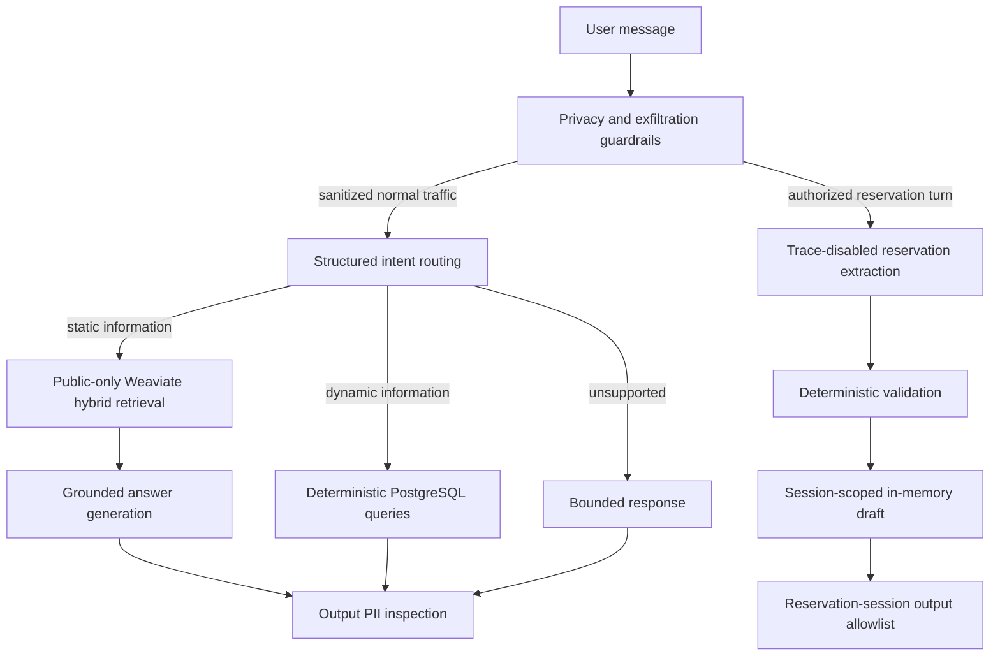

# Parking Assistant — Stage 1

A production-oriented Python parking assistant with grounded public-information RAG,
deterministic operational reads, typed reservation-detail collection, and defense-in-depth
privacy controls. Stage 1 collects reservation details but never approves, persists, or books
a reservation.

## Architecture



LangChain provides model, embedding, and structured-output integrations. LangSmith traces the
sanitized normal path with meaningful routing, retrieval, generation, and dynamic-query spans.
LangGraph, administrator approval, persistence, and MCP are intentionally not part of Stage 1.

## Static and dynamic data separation

- Weaviate stores only approved public static knowledge: location, access, policies,
  restrictions, booking instructions, and FAQ content. Every retrieval applies a mandatory
  `visibility=public` filter.
- PostgreSQL stores operational truth: parking spaces and statuses, current pricing, opening
  hours, and facility configuration. Dynamic answers use explicit SQLAlchemy queries, not RAG.
- Customer PII is never intentionally embedded or stored in Weaviate. Reservation drafts exist
  only in process memory and are deleted on cancellation or process exit.

The application uses hybrid retrieval (`RAG_HYBRID_ALPHA=0.5`) because it combines semantic
matching with exact term signals. The final comparison against semantic and BM25 modes is in
[`evaluation/stage1_report.md`](evaluation/stage1_report.md).

## Setup

Requirements: Python 3.12, [`uv`](https://docs.astral.sh/uv/), Docker Compose v2, an OpenAI API
key, and optionally a LangSmith key.

```powershell
Copy-Item .env.example .env
uv python install 3.12
uv sync --locked
docker compose up -d
uv run alembic upgrade head
uv run python -m parking_assistant.db.seed
uv run python -m parking_assistant.rag.ingestion
```

The migration and seed commands initialize PostgreSQL. Ingestion loads only `data/static/*.md`,
validates public metadata, chunks the documents, creates application-side embeddings, and
upserts them into `PublicParkingKnowledge`.

## Use the assistant

```powershell
uv run python -m parking_assistant.api.cli "Where is the parking located?"
uv run python -m parking_assistant.api.cli "How many spaces are currently available?"
uv run python -m parking_assistant.api.cli "Are you open on Monday?"
uv run python -m parking_assistant.api.cli "What does parking cost?"
uv run python -m parking_assistant.api.cli --interactive
```

Synthetic interactive reservation example:

```text
I want to reserve a parking space tomorrow.
My name is Demo User and my demo plate is DEMO123.
Tomorrow from 10:00 to 13:00.
Actually, change the plate to TEST456.
Cancel this reservation.
```

The collector extracts first name, surname, car number, start, and end across turns. Names,
plates, periods, corrections, and completion are deterministically normalized and validated.
A complete draft is only ready for a future approval step; it is not checked for interval
availability, persisted, confirmed, or booked.

## Privacy and security

Microsoft Presidio runs locally with deterministic recognizers for `PERSON`, `EMAIL_ADDRESS`,
`PHONE_NUMBER`, and the configured `CAR_NUMBER` pattern. Normal traffic is redacted before
intent classification, LangSmith tracing, Weaviate queries, embeddings, or grounded model
calls. General output is inspected again; approved public place names are explicitly preserved.

Reservation messages bypass normal routing and retrieval. Raw reservation details go only to
the authorized structured extractor under `tracing_context(enabled=False)`, deterministic
validation, and session-keyed memory. Complete responses may show only that session's validated
identity, plate, and period. Deterministic policy checks stop explicit prompt, secret, customer,
database, and vector-store exfiltration requests before model or data access.

Automated detection is defense in depth, not perfect authorization or a complete DLP system.

## LangSmith observability and demo evidence

No credential is hardcoded. Configure a dedicated project in `.env` or the shell:

```powershell
$env:LANGSMITH_TRACING = "true"
$env:LANGSMITH_PROJECT = "parking-assistant-stage1"
uv run python -m parking_assistant.evaluation.demo_traces
```

Normal traces use `parking_assistant_request`, `intent_routing`, `static_rag`,
`hybrid_retrieval`, `grounded_generation`, and `dynamic_query` where applicable. Inputs are
already sanitized and safe metadata includes route, retrieval mode, public source IDs, result
count, and PII entity types—not raw detected values. Reservation extraction remains untraced.

The presentation evidence plan is
[`docs/stage1_screenshot_checklist.md`](docs/stage1_screenshot_checklist.md).

## Evaluation

Run all evaluators against the configured real services:

```powershell
uv run python -m parking_assistant.rag.evaluation --all --k 5 `
  --output evaluation/retrieval_report.json
uv run python -m parking_assistant.evaluation.answer_quality --upload-langsmith
uv run python -m parking_assistant.evaluation.performance --samples 3
uv run python -m parking_assistant.guardrails.evaluation `
  --output evaluation/security_report.json
uv run python -m parking_assistant.evaluation.stage1_report
```

- Retrieval: 18 fixed queries, identical K, Precision@K, Recall@K, and MRR for semantic, BM25,
  and hybrid.
- Answer quality: 12 stable public questions scored for correctness, groundedness, and relevance;
  the same measured outputs and feedback are published as a LangSmith offline experiment.
- Performance: configurable sample count with average, p50, p95, and failures for hybrid
  retrieval, static RAG, PostgreSQL, routing, and a complete request.
- Security: 20 synthetic cases measuring leakage, malicious blocking, benign pass-through, and
  cross-session isolation.

The concise final report is [`evaluation/stage1_report.md`](evaluation/stage1_report.md), with
machine-readable underlying results in the adjacent JSON files.

## Verification

```powershell
uv run ruff check .
uv run mypy
uv run pytest

$env:RUN_INTEGRATION_TESTS = "1"
uv run pytest -m integration --no-cov
```

Unit/default tests mock model output where appropriate. Opt-in integrations exercise configured
OpenAI, PostgreSQL, and Weaviate services using public or explicitly synthetic data only.

## Important configuration

```text
OPENAI_MODEL=gpt-4.1-mini
OPENAI_EMBEDDING_MODEL=text-embedding-3-small
RESERVATION_CAR_NUMBER_PATTERN=^[A-Z0-9]{4,12}$
RAG_RETRIEVAL_LIMIT=5
RAG_HYBRID_ALPHA=0.5
LANGSMITH_TRACING=false
LANGSMITH_PROJECT=parking-assistant-stage1
```

## Current limitations and roadmap

- OpenAI/Weaviate behavior and latency depend on external services and network conditions.
- Answer-quality judging uses a small curated dataset and an LLM judge; results are evidence,
  not a formal proof.
- PII/prompt-injection patterns can have false positives and false negatives.
- Reservation state has no TTL, authentication, distribution, durability, approval, or booking.

Stage 2 may add authenticated administrator interaction, a reservation lifecycle, human approval,
LangGraph interrupt/resume, and durable state. Stage 3 may add a least-privilege MCP server after
approval boundaries exist. Neither is implemented here.
